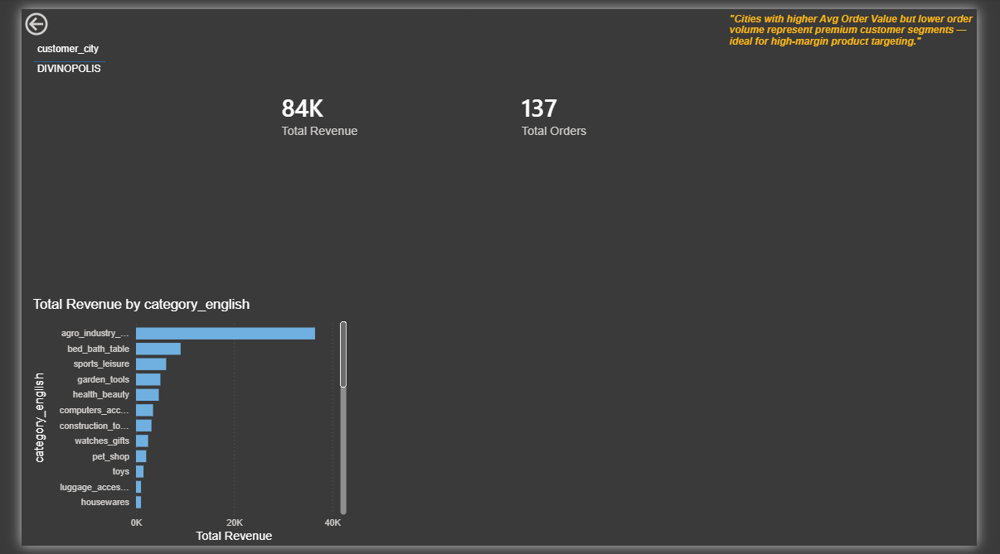
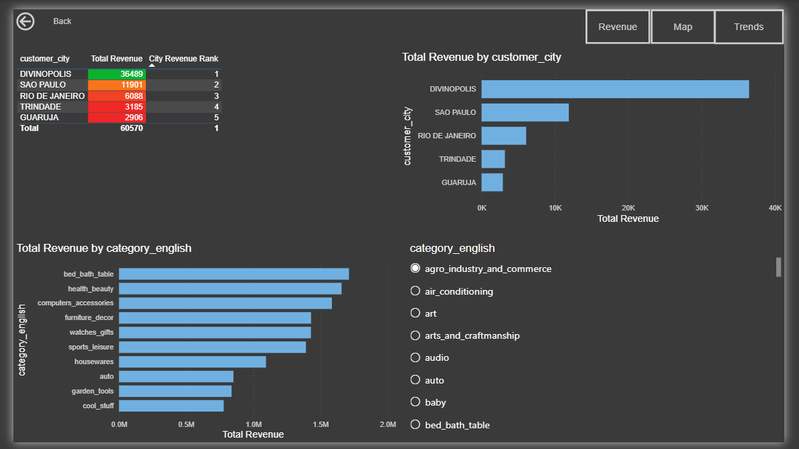
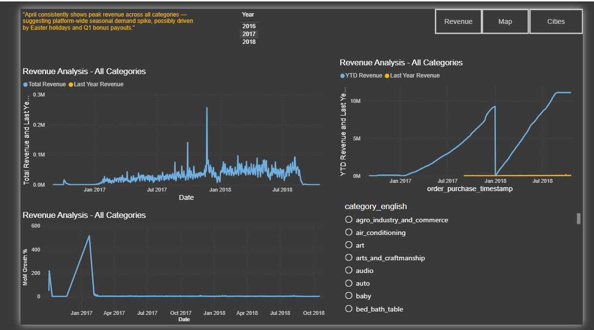
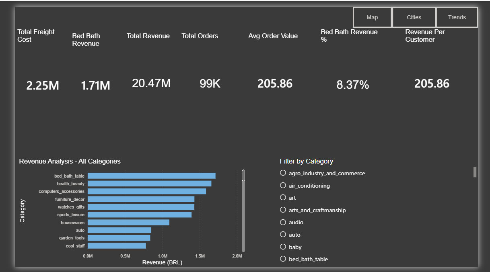
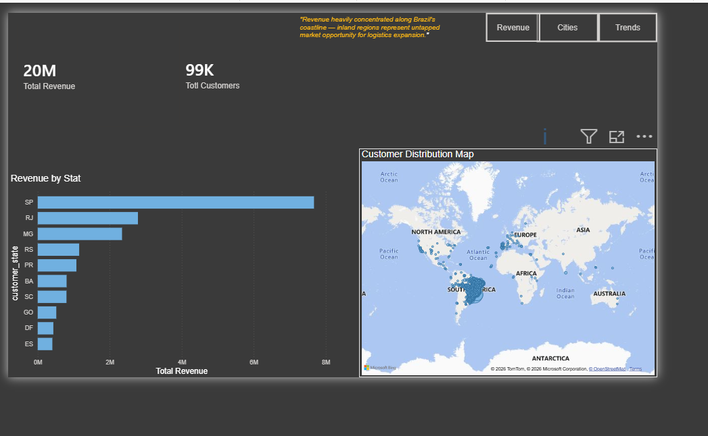

# Brazilian eCommerce — Power BI Dashboard 🛒📊

Interactive 5-page Power BI dashboard analyzing **99,441 orders** from the Brazilian eCommerce dataset (2016–2018).

---

## 🎯 Project Objective

Visualize revenue trends, geographic distribution, city-level performance, and category insights using advanced DAX measures and interactive Power BI visuals.

---

## 🛠️ Tools Used

- **Power BI Desktop** — Dashboard design, visuals, drill-through
- **DAX** — CALCULATE, RANKX, TOTALYTD, SAMEPERIODLASTYEAR
- **Data Source** — Brazilian eCommerce dataset (Kaggle / Olist)

---

## 📊 Dashboard Pages

| Page | Description |
|------|-------------|
| **Revenue Analysis** | 7 KPI cards, revenue by category, dynamic titles, category slicer |
| **Trend Analysis** | YTD revenue, MoM growth %, last year comparison, year slicer |
| **City & Category Analysis** | Top 5 cities (RANKX + conditional formatting), top 10 categories, drill-through |
| **City Detail** | Drill-through page — revenue, orders, category breakdown per city |
| **Geographic Analysis** | Map visual, revenue by state |

---

## 🖼️ Dashboard Preview

### 💰 Revenue Analysis

### 📈 Trend Analysis

### 🏙️ City & Category Analysis

### 🔍 City Detail (Drill-through)

### 🗺️ Geographic Analysis

---

## 🧮 DAX Measures Built

`Total Revenue` · `Total Orders` · `Avg Order Value` · `YTD Revenue` · `Last Year Revenue` · `MoM Growth %` · `City Revenue Rank` · `Category Revenue Rank` · `Running Total Revenue` · `Dynamic Title` · `Total Customers` · `Revenue Per Customer`

---

## 📌 Key Business Insights

- **São Paulo** generates ~40% of total revenue — largest single market by far
- **Coastal Brazil dominates** — inland regions are untapped market opportunity
- **Rio de Janeiro** = premium city (high AOV, low order volume)
- **99,441 customers = 99,441 orders** → zero repeat customers across 2 years — major retention gap
- **Divinópolis** — 1 order worth 36K BRL (likely B2B outlier skewing averages)
- **April** shows peak revenue across all categories

---

## 🔗 Related Project

- [Brazilian eCommerce SQL + Excel Analysis](https://github.com/imperfectt2513/brazilian-ecommerce-analysis)

---

## 📦 Dataset

- **Source:** Brazilian eCommerce Public Dataset — Olist (via Kaggle)
- **Records:** 99,441 orders
- **Period:** 2016–2018

---

## 👤 Author

**Dnyaneshwar Tate** | B.Tech Computer Science | 2026
[LinkedIn](https://linkedin.com/in/dnyaneshwartate) · [GitHub](https://github.com/imperfectt2513)
